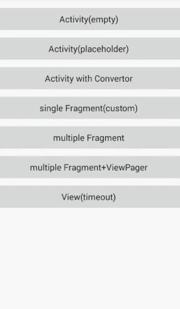
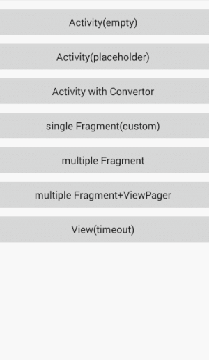
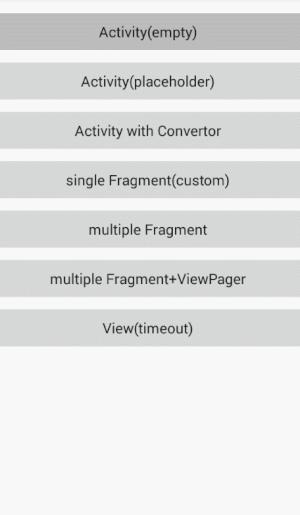
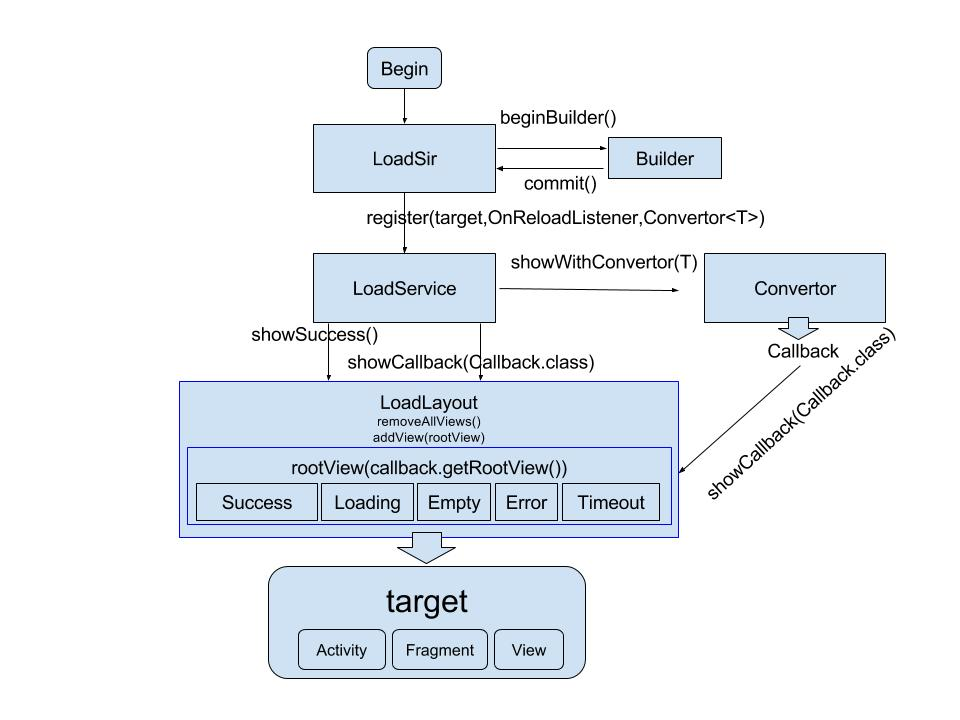

English | [中文](README-cn.md)

What's LoadSir?
---

[](https://android-arsenal.com/details/1/6227)
[](https://bintray.com/kingja/maven/loadsir#files/com%2Fkingja%2Floadsir%2Floadsir%2F1.2.0)
:point_right:[](https://github.com/KingJA/LoadSir/releases):point_left:


***LoadSir*** is a lightweight, good expandable Android library used for displaying different pages like **loading**,
**error**, **empty**, **timeout** or even your **custom page** when you load data from database or a REST service. LoadSir is very different from
other similar libraries. I mean... ***better***.

Preview - samples
---
| **in [Activity](https://github.com/KingJA/LoadSir/blob/master/app/src/main/java/sample/kingja/loadsir/target/NormalActivity.java)**|**in [View](https://github.com/KingJA/LoadSir/blob/master/app/src/main/java/sample/kingja/loadsir/target/ViewTargetActivity.java)**|**in [Fragment](https://github.com/KingJA/LoadSir/blob/master/app/src/main/java/sample/kingja/loadsir/target/NormalFragment.java)**|
|:---:|:----:|:----:|
||||

| **[Placeholder](https://github.com/KingJA/LoadSir/blob/master/app/src/main/java/sample/kingja/loadsir/target/PlaceholderActivity.java)**|**[Multi-Fragment](https://github.com/KingJA/LoadSir/blob/master/app/src/main/java/sample/kingja/loadsir/target/MultiFragmentActivity.java)**|**[ViewPager+Fragment](https://github.com/KingJA/LoadSir/blob/master/app/src/main/java/sample/kingja/loadsir/target/MultiFragmentWithViewPagerActivity.java)**|
|:---:|:----:|:----:|
||||

Download Demo
---


Feature
---
* :star: support for Activity, Fragment, Fragment(v4), View
* :star: support for Multi-Fragment, Fragment+ViewPager
* :star: convert http result structure into a Callback
* :star: no need to modify the layout
* :star: only load one layout once
* :star: no need to set enum or constant for status code
* :star: set your own onClick logic in custom Callback
* :star: no preloaded load page
* :star: support for keeping the toolbar, titleview
* allow to customize your own load page
* set the retry onClick listener `OnReloadListener`
* set the default load page
* add multi load pages
* thread-safety

How does LoadSir work?
---
<div align="center"></div>

🚀 Getting started
---

LoadSir only needs 3 steps: **1. Config** -> **2. Register** -> **3. Display**

### Download

```groovy
compile 'com.kingja.loadsir:loadsir:1.3.2'
```

### Step 1: Config
There are two ways to set the config. Add your custom pages and set the default page.

* ###### Global Config
Set config with singleton pattern, you can do it in your Application. No matter where you do this job, you could get the
unique LoadSir everywhere.

```java
public class App extends Application {
    @Override
    public void onCreate() {
        super.onCreate();
        LoadSir.beginBuilder()
                .addCallback(new ErrorCallback())
                .addCallback(new EmptyCallback())
                .addCallback(new LoadingCallback())
                .addCallback(new TimeoutCallback())
                .addCallback(new CustomCallback())
                .setDefaultCallback(LoadingCallback.class)
                .commit();
    }
}
```
* ###### Single Config
If you want to create another specific LoadSir, you can set config like this.

```java
LoadSir loadSir = new LoadSir.Builder()
                .addCallback(new LoadingCallback())
                .addCallback(new EmptyCallback())
                .addCallback(new ErrorCallback())
                .build();
loadService = loadSir.register(this, new Callback.OnReloadListener() {
    @Override
    public void onReload(View v) {
        // retry logic
    }
});
```
### Step 2: Register

Tell LoadSir which "layout" you want to be replaced with LoadLayout.

* ###### Register an Activity
The registered `Activity` will be handled by LoadSir.
```java
@Override
protected void onCreate(@Nullable Bundle savedInstanceState) {
    super.onCreate(savedInstanceState);
    setContentView(R.layout.activity_content);
    
    // You can change the callback on sub thread directly.
    LoadService loadService = LoadSir.getDefault().register(this, new Callback.OnReloadListener() {
        @Override
        public void onReload(View v) {
            // your retry logic 
        }
    });
}
```

* ###### Register a View
The registered `ImageView` will be handled by LoadSir.
```java
ImageView imageView = (ImageView) findViewById(R.id.iv_img);
LoadSir loadSir = new LoadSir.Builder()
        .addCallback(new TimeoutCallback())
        .setDefaultCallback(LoadingCallback.class)
        .build();
loadService = loadSir.register(imageView, new Callback.OnReloadListener() {
    @Override
    public void onReload(View v) {
        loadService.showCallback(LoadingCallback.class);
        // your retry logic
    }
});
```

* ###### Register a Fragment
The registered `Fragment` will be handled by LoadSir.
Use it in Fragment is a bit different from the other two, follow the template code.
```java
@Nullable
@Override
public View onCreateView(LayoutInflater inflater, @Nullable ViewGroup container, @Nullable Bundle savedInstanceState) {
    //step 1：obtain root view
    rootView = View.inflate(getActivity(), R.layout.fragment_a_content, null);
    
    //step 2：obtain the LoadService
    LoadService loadService = LoadSir.getDefault().register(rootView, new Callback.OnReloadListener() {
        @Override
        public void onReload(View v) {
            // your retry logic
        }
    });
    
    //step 3：return the LoadLayout from LoadService
    return loadService.getLoadLayout();
}
```

### Step 3: Display
What to show after fetching data (from REST service or database...)?
* ###### Direct Display
```java
protected void loadFromNet() {
    // do net job/load data...

    // callback after finish
    loadService.showSuccess(); // successful case -> show the data, eg RecyclerView,...
    --- OR ---
    loadService.showCallback(EmptyCallback.class); // do/show something else
}
```
**Info:** `showSuccess()` calls the `SuccessCallback` to "hide" LoadSir and show the content.

* ###### Convertor Display (recommended)
If you want LoadSir to do callback automatically, you can pass a Convertor when you register.

```java
LoadService loadService = LoadSir.getDefault().register(this, new Callback.OnReloadListener() {
    @Override
    public void onReload(View v) {
         // retry logic
    }}, new Convertor<HttpResult>() {
    @Override
    public Class<? extends Callback> map(HttpResult httpResult) {
        Class<? extends Callback> resultCode = SuccessCallback.class;
        switch (httpResult.getResultCode()) {
            case SUCCESS_CODE:
                if (httpResult.getData().size() == 0) {
                    resultCode = EmptyCallback.class;
                }else{
                    resultCode = SuccessCallback.class;
                }
                break;
            case ERROR_CODE:
                resultCode = ErrorCallback.class;
                break;
        }
        return resultCode;
    }
});
```
Pass a HttpResult, now you start up a robot LoadSir.
```java
loadService.showWithConvertor(httpResult);
```

### Customize
You can customize your own load page like loading, empty, error, timeout, etc. Provide the layout and fill the retry
logic (if necessarily).

```java
public class CustomCallback extends Callback {

    @Override
    protected int onCreateView() {
        return R.layout.layout_custom;
    }

    @Override
    protected boolean onReloadEvent(final Context context, View view) {
        Toast.makeText(context.getApplicationContext(), "Hello buddy! :p", Toast.LENGTH_SHORT).show();
        (view.findViewById(R.id.iv_gift)).setOnClickListener(new View.OnClickListener() {
            @Override
            public void onClick(View v) {
                Toast.makeText(context.getApplicationContext(), "It's your gift! :p", Toast.LENGTH_SHORT).show();
            }
        });
        return true;
    }

    //set visibility of SuccessView when callback is attach to Layout,true:visible, false: invisible
    @Override
    public boolean getSuccessVisible() {
        return super.getSuccessVisible();
    }

    //Called when the view of Callback is attached to LoadLayout.
    @Override
    public void onAttach(Context context, View view) {
        super.onAttach(context, view);
    }

    //Called when the view of Callback was detached from LoadLayout.
    @Override
    public void onDetach() {
        super.onDetach(context, view);
    }

}
```

### Modify Callback Dynamically
Access the view of a `Callback`.
```java
loadService = LoadSir.getDefault().register(...);
loadService.setCallBack(EmptyCallback.class, new Transport() {
   @Override
   public void order(Context context, View view) {
       TextView mTvEmpty = (TextView) view.findViewById(R.id.tv_empty);
       mTvEmpty.setText("Fine, no data. You must fill it!");
   }
});
```
### Default Callback in LoadSir

```java
ProgressCallback loadingCallback = new ProgressCallback.Builder()
        .setTitle("Loading", R.style.Hint_Title)
        .build();

HintCallback hintCallback = new HintCallback.Builder()
        .setTitle("Error", R.style.Hint_Title)
        .setSubTitle("Sorry, buddy, I will try it again.")
        .setHintImg(R.drawable.error)
        .build();

LoadSir loadSir = new LoadSir.Builder()
        .addCallback(loadingCallback)
        .addCallback(hintCallback)
        .setDefaultCallback(ProgressCallback.class)
        .build();
```


### :bulb: About placeholder effect
The effect of placeholder is just like the library [ShimmerRecyclerView](https://github.com/sharish/ShimmerRecyclerView)
works. LoadSir do the similar job only through a PlaceHolderCallback, just a custom ***Callback***. That feeling was
amazing. :ghost:

## Docs
* :point_right: [FAQ](docs/FAQ.md)
* 📌 [Version changelog](docs/changelog.md)
* [Best Practice](docs/BestPractice.md)
* [What will the next version include?](docs/NextVersion.md)

## ProGuard

```xml
-dontwarn com.kingja.loadsir.**
-keep class com.kingja.loadsir.** {*;}
```
## Contact Me
Any questions: Welcome to contact me.
* Email: kingjavip@gmail.com

## License

    Copyright 2017 KingJA

    Licensed under the Apache License, Version 2.0 (the "License");
    you may not use this file except in compliance with the License.
    You may obtain a copy of the License at

        http://www.apache.org/licenses/LICENSE-2.0

    Unless required by applicable law or agreed to in writing, software
    distributed under the License is distributed on an "AS IS" BASIS,
    WITHOUT WARRANTIES OR CONDITIONS OF ANY KIND, either express or implied.
    See the License for the specific language governing permissions and
    limitations under the License.
